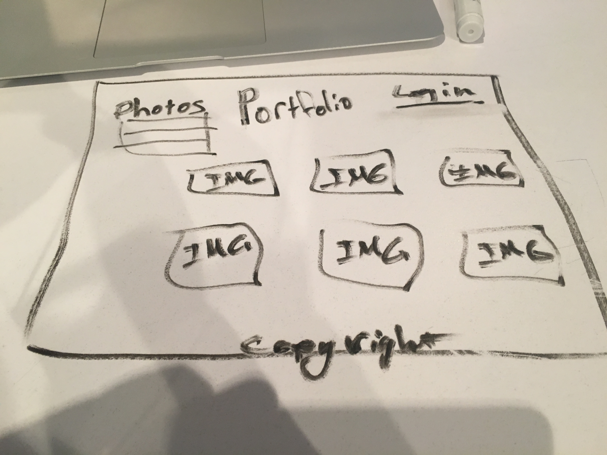
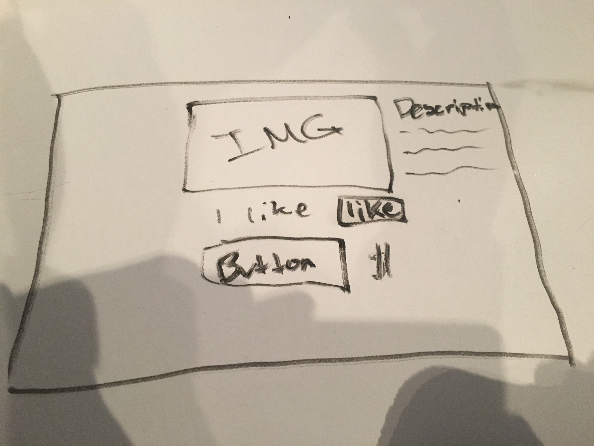
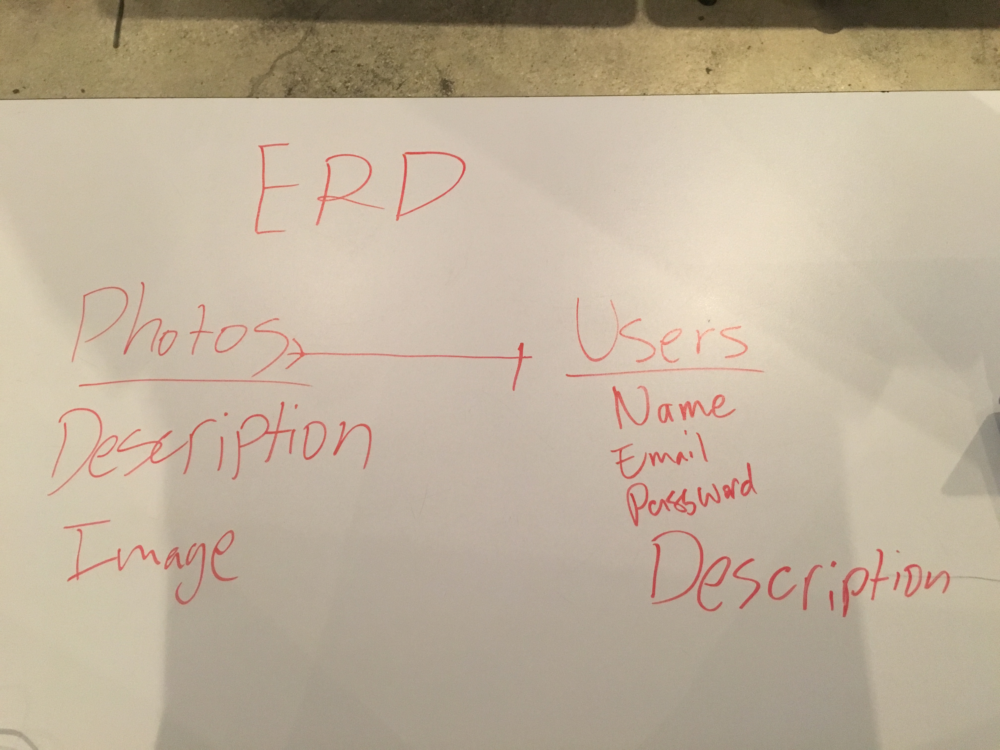

#Project 2
  For my second Project, I will be designing a photo gallery to display photos. Users will be able to sign in and browse through photos I have uploaded to a gallery. Users will also enjoy high quality photos that they can then share with their friends.

#Trello Board
link_to https://trello.com/b/L65G5HfJ/welcome-board

#Technologies
  The programs I will be using to design this app will be:
  1. HTML
  2. CSS
  3. Ruby
  4. jQuery

#Wireframes

#ERD

#MVP
My goal for MVP is to have a fully functional site where users can at least login and view photos.

#Approach Taken
I first started making my Wireframes. I had an idea of what I wanted my site to look like. I then began on my ERD's. This would give me direction and a starting place to begin making my app. After making my ERD, I began making my controllers and models. After making the controller and models, I began to work on my routes.

#Installation Instructions
To install game you must first

#Known Issues
You cant buy images yet. Some images render differently depending on quality and size of photo. Still no animations.
